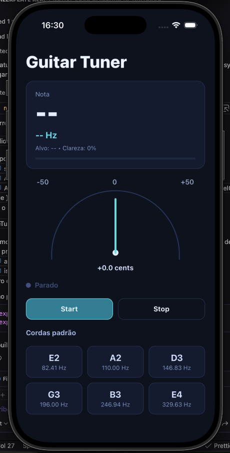

# Guitar Tuner App (Expo + TypeScript)

Boilerplate for a guitar tuner app with:

- `react-native-audio-record` for PCM audio capture
- `YIN` algorithm in pure TypeScript
- `useTuner` for capture + detection orchestration
- `pitchDetector` and `noteUtils` utilities
- `TunerScreen` with animated needle and standard string grid

## Preview

<div align="center">
  
</div>

---

## Structure

- src/hooks/useTuner.ts
- src/utils/pitchDetector.ts
- src/utils/noteUtils.ts
- src/services/audio/audioCapture.ts
- src/screens/TunerScreen.tsx
- src/components/TunerNeedle.tsx
- src/components/StringGrid.tsx
- src/constants/tuning.ts
- src/config/audioConfig.ts
- src/types/tuner.ts

## Dependencies

Already included:

- `react-native-audio-record`

## Running the project

```bash
npm install
npm run start
```

## Important note about Expo

`react-native-audio-record` is a native module. Therefore:

1. It does not work in standard Expo Go.
2. Use a **Dev Build**.
3. Generate native projects with prebuild:

```bash
npx expo prebuild
```

Then run on a device/emulator:

```bash
npm run android
# or
npm run ios
```

## Permissions

Permissions have already been configured in `app.json`:

- Android: `RECORD_AUDIO`
- iOS: `NSMicrophoneUsageDescription`

## Precision adjustments applied

- `sampleRate`: 44100
- `frameSize`: 2048
- overlap: 75% (hop 512)
- YIN threshold: 0.08
- smoothing: simple EMA (`alpha: 0.2`)
- silence gate via RMS
